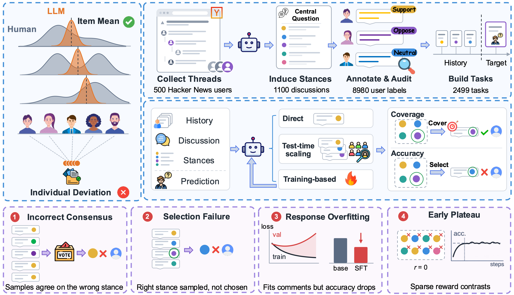
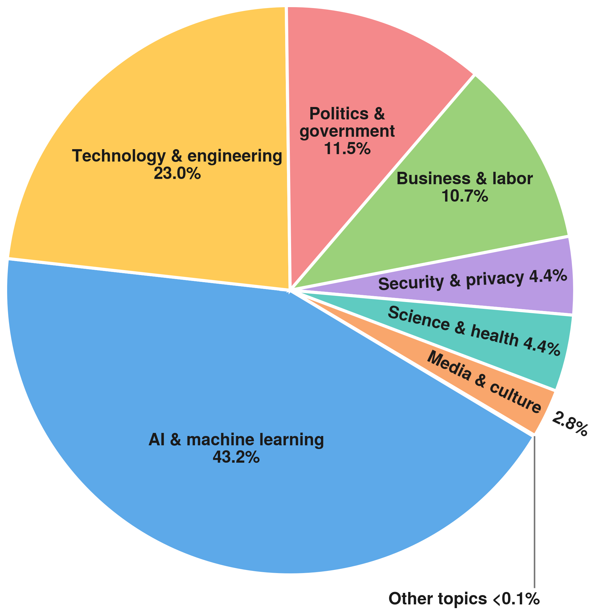

<h1 align="center">Where Do Test-Time Scaling and Training<br>Fall Short in Individual Stance Prediction?</h1>

<p align="center">
  <a href="https://arxiv.org/abs/2609.33155"></a>
  <a href="https://github.com/stance-bench/Stance-Bench"></a>
  
  <a href="LICENSE"></a>
</p>

This repository contains **StanceBench**, a benchmark for predicting which side a specific person will take in a new discussion, and the code for our method.

Each task gives a model a Hacker News user's earlier comments, a new discussion the user commented on, and the stances people took in that discussion. The model has to predict which stance this user took.

<p align="center">
  
</p>

## 🚀 Installation

You need Python 3.10 or later. Run all commands from the repository root.

```bash
git clone https://github.com/stance-bench/Stance-Bench.git
cd Stance-Bench
python -m venv .venv
source .venv/bin/activate

pip install -r requirements.txt         # data loading and evaluation
pip install -r requirements-model.txt   # only needed to run our method (PyTorch, Transformers)
```

## 📚 Data

The data is already in [`data/`](data/), so you don't need to download anything separately. StanceBench has **2,499 tasks from 500 Hacker News users**. No user appears in both the development and test sets.

All data comes from public Hacker News discussions and has been anonymized. Usernames, links, email addresses, and phone numbers are removed, all IDs are replaced with random ones, and exact timestamps are replaced with relative times.

| Split | Users | Tasks |
| --- | ---: | ---: |
| Development | 250 | 1,250 |
| Test | 250 | 1,249 |

<p align="center">
  
</p>

### What a task contains

| Field | Description |
| --- | --- |
| `history` | The user's earlier comments in other discussions, oldest first. Each comment comes with the stance the user took there. |
| `target_stimulus` | The new discussion: its title, central question, summary, and the comments visible in the thread. |
| `target_stimulus.candidate_labels` | The stances in that discussion. Each one has a name, a definition, and a boundary. |
| `candidate_order` | The labels a model can predict, in the order our prompts list them. It includes `OTHER` and leaves out `NO_STANCE`. |

The model predicts a single label ID such as `L2`. Label IDs only have meaning within their own discussion: `L1` in one discussion has nothing to do with `L1` in another. The gold label comes from the comment the user actually wrote in the target discussion. That comment is held out from the model's input.

### Files

| File | Contents |
| --- | --- |
| `data/processed/task_contexts.jsonl.gz` | Model inputs for all 2,499 tasks |
| `data/processed/task_targets.jsonl.gz` | Gold labels and held-out target comments. **For evaluation only; never put this in model inputs.** |
| `data/evidence_{dev,test}.jsonl.gz` | Eight earlier comments from the same user, selected as evidence for each task. Our method reads these. |
| `data/processed/stance_labels.jsonl.gz` | All 8,980 labeled user–discussion pairs the benchmark is built from |
| `data/processed/taxonomies.jsonl.gz` | Stance definitions for 1,100 discussions |
| `data/processed/splits.json` | Which split each user belongs to |

## 🧠 Training

Our method keeps Qwen3-8B frozen and fits only two fusion coefficients on the development set. See the [paper](https://arxiv.org/abs/2609.33155) for details.

**Step 1.** Score the development tasks with the frozen model:

```bash
python -m stancebench score --split dev --device auto \
  --output outputs/dev_scores.jsonl --resume
```

**Step 2.** Fit the coefficients:

```bash
python -m stancebench fit --scores outputs/dev_scores.jsonl \
  --output outputs/coefficients.json
```

## 📊 Evaluation

### Evaluate our method

Score the test set with the same settings you used for dev, apply the fitted coefficients, and then compute the metrics:

```bash
python -m stancebench score --split test --device auto \
  --output outputs/test_scores.jsonl --resume

python -m stancebench predict --scores outputs/test_scores.jsonl \
  --coefficients outputs/coefficients.json --output outputs/predictions.jsonl

python -m stancebench evaluate --predictions outputs/predictions.jsonl \
  --output outputs/metrics.json
```

### Evaluate your own model

Write one prediction per test task, one JSON object per line (`.jsonl` or `.jsonl.gz`):

```json
{"task_id": "task_003edbdbe5be450189b6", "label_id": "L2"}
```

Then run the evaluator:

```bash
python -m stancebench evaluate --predictions predictions.jsonl --output outputs/metrics.json
```

To evaluate on the development set, add `--split dev`. If some predictions are missing, `--allow-missing` scores them as wrong instead of raising an error.

## 📝 Citation

If you use StanceBench or our code, please cite:

```bibtex
@article{zhao2026test,
  title   = {Where Do Test-Time Scaling and Training Fall Short in Individual Stance Prediction?},
  author  = {Zhao, Yuyang and Liu, Xuan and Shang, HaoYang and Jin, Haojian},
  journal = {arXiv preprint arXiv:2609.33155},
  year    = {2026}
}
```

## ⚖️ License

This project is released under the [MIT License](LICENSE).
